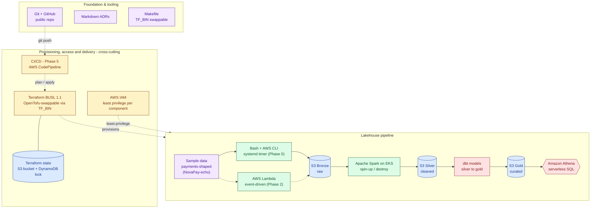

# cerberus-platform

A portfolio project that builds a working AWS lakehouse end to end — ingestion,
medallion storage, transformation, a queryable serving layer, orchestration,
observability, and IaC — demonstrating Data Platform, Platform, and Cloud
Engineering competence in one repository.

## Status

✅ Phase 0 (foundation, built by hand) — complete.
🔨 Phase 1 (MVP: end-to-end lakehouse) — in progress.

See [docs/plan.md](docs/plan.md) for the full phased roadmap (Phases 0–7)
and [Phases.md](Phases.md) for subtask-level progress.

The platform models **synthetic payments data** from Phase 1 onward.

## Architecture



This is the target end-state, not current state (see [Status](#status)
above). For current-state notes, the full stack table, and the governing
constraints behind this diagram, see
[docs/architecture.md](docs/architecture.md).

## Repository layout

```
.
├── docs/                 # plan, architecture notes, ADRs
├── terraform/
│   ├── bootstrap/        # one-time state backend (S3 + DynamoDB lock)
│   ├── modules/          # reusable modules (storage, IAM, ...)
│   └── envs/dev/         # dev environment root module
├── ingestion/scripts/    # ingestion scripts: synthetic payments generator
│                         #   (Python, Phase 1); ingest_weather.sh (Phase 0,
│                         #   unscheduled — retired as the active feed)
├── ingestion/systemd/    # systemd --user service + timer for the
│                         #   payments generator (daily)
├── transform/dbt/        # dbt project: bronze → silver → gold
└── data/samples/         # small sample datasets for local testing
```

## Getting started

This project is being built incrementally; see [docs/plan.md](docs/plan.md)
for what's done and what's next. Common tasks are wired up in the
[Makefile](Makefile).

## Documentation

- [docs/plan.md](docs/plan.md) — the build plan and phased roadmap
- [docs/architecture.md](docs/architecture.md) — architecture overview
- [docs/adr/](docs/adr/) — architecture decision records
- [docs/courses-map-to-phases.md](docs/courses-map-to-phases.md) — which
  courses (if any) map to each phase, and where no course exists
- [article.md](article.md) — rules for the weekly engineering write-up,
  generated via `/write-article`; published articles land in `articles/`
  once the first one exists

## License

[MIT](LICENSE)
