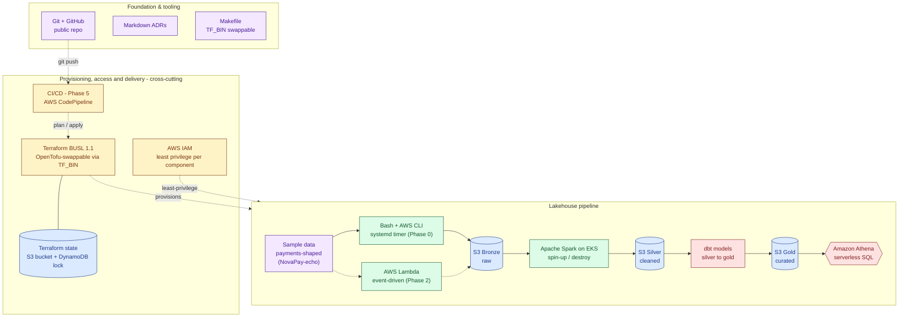

# cerberus-platform

A portfolio project that builds a working AWS lakehouse end to end — ingestion,
medallion storage, transformation, a queryable serving layer, orchestration,
observability, and IaC — demonstrating Data Platform, Platform, and Cloud
Engineering competence in one repository.

## Status

✅ Phase 0 (foundation, built by hand) — complete.
✅ Phase 1 (MVP: end-to-end lakehouse) — complete. A reviewer can run a
real Athena query against gold and get a result; `terraform apply` and
`terraform destroy` were verified live against the whole stack.
✅ Phase 2 (event-driven ingestion) — complete. Ingestion runs on a Lambda
triggered by EventBridge Scheduler, confirmed firing unattended; the
Phase 0 systemd timer is retired.
✅ Phase 3 (scalable compute) — complete. ADR 0007 (VPC network design for
Spark-on-EKS) is accepted; the full stack (VPC, EKS, Spark Operator, Spark
job) was applied live, a real Spark job ran on EKS and wrote verified
output to silver, and the stack was destroyed cleanly.
✅ Phase 4 (orchestration) — complete. ADR 0009 chose AWS Step Functions
over Airflow; a state machine (Lambda → Spark-on-EKS/dbt via ECS Fargate →
Athena) orchestrates the full ingest → transform → serve flow, tuned for
retries and execution visibility, retargeted from EventBridge Scheduler,
and verified with a real live execution end to end.

See [docs/plan.md](docs/plan.md) for the full phased roadmap (Phases 0–7)
and [Phases.md](Phases.md) for subtask-level progress.

The platform models **synthetic payments data** from Phase 1 onward.

## Architecture



This is the target end-state, not current state (see [Status](#status)
above). For current-state notes, the full stack table, and the governing
constraints behind this diagram, see
[docs/architecture.md](docs/architecture.md).

## Repository layout

```
.
├── .claude/commands/     # /start-day, /end-day, /write-article,
│                         #   /note-maker session commands
├── docs/                 # plan, architecture notes, ADRs, learning notes
├── articles/             # weekly engineering articles (see article.md)
├── terraform/
│   ├── bootstrap/        # state backend as code (S3 + DynamoDB lock)
│   ├── modules/          # reusable modules (S3 medallion, IAM, Glue
│   │                     #   catalog, Athena, Lambda ingestion, VPC, EKS,
│   │                     #   Spark Operator, Spark job service account,
│   │                     #   orchestration runner (ECR/Fargate), Step
│   │                     #   Functions)
│   └── envs/dev/         # dev environment root module
├── ingestion/scripts/    # ingestion scripts: synthetic payments generator
│                         #   + shared payments_lib.py core (Python, Phase
│                         #   1); ingest_weather.sh (Phase 0, unscheduled —
│                         #   retired as the active feed); run_payments_
│                         #   scheduled.sh (Phase 0's systemd wrapper,
│                         #   unscheduled — retired 2.5, Lambda is now the
│                         #   only active ingestion path)
├── ingestion/lambda/     # event-driven ingestion Lambda handler, wraps
│                         #   payments_lib.py (Phase 2)
├── transform/scripts/    # bronze → silver → gold transform (Python,
│                         #   Phase 1): silver = flattened event history,
│                         #   gold = current-state (still denormalized)
├── transform/dbt/        # dbt project: gold fact/dimension models (1.9)
├── transform/spark/      # PySpark bronze -> silver job (3.5), run on the
│                         #   EKS cluster via the Spark Operator (3.4);
│                         #   spark-application.yaml + submit_job.sh (not
│                         #   Terraform-managed -- see its own header)
├── orchestration/        # state_machine.asl.json.tftpl -- the orchestration
│                         #   state machine's ASL definition (4.2/4.3),
│                         #   templated by terraform/modules/step_functions
├── orchestration/runner/ # container image the state machine's ECS Fargate
│                         #   transform/dbt steps run: Dockerfile,
│                         #   entrypoint scripts, shared lib.sh (4.2)
├── serving/queries/      # demo Athena SQL against gold (1.10)
├── serving/scripts/      # runs the demo query as cerberus-serving
└── data/samples/         # small sample datasets for local testing
```

## Getting started

This project is being built incrementally; see [docs/plan.md](docs/plan.md)
for what's done and what's next. Common tasks are wired up in the
[Makefile](Makefile).

### Working across machines

This project runs on two machines (workstation + WSL2 laptop) synced through
GitHub. Both are configured with `pull.rebase = true` so `git pull` rebases
cleanly instead of creating a merge commit.

**First ritual on any machine — run `/git-cleaner` in Claude Code.** It checks
both repos (`cerberus-platform` and `tessera`) for uncommitted changes, fetches
and rebases from origin, prunes stale remote-tracking branches, and warns if
`terraform init` needs re-running (providers are gitignored and don't travel
between machines).

**Golden rule:** push before switching machines. A clean push means the other
machine can always fast-forward without conflicts.

On a fresh clone, set the rebase pull strategy once per repo:

```bash
git config pull.rebase true
```

## Documentation

- [docs/plan.md](docs/plan.md) — the build plan and phased roadmap
- [docs/architecture.md](docs/architecture.md) — architecture overview
- [docs/adr/](docs/adr/) — architecture decision records
- [docs/courses-map-to-phases.md](docs/courses-map-to-phases.md) — which
  courses (if any) map to each phase, and where no course exists
- [docs/notes/](docs/notes/) — day-by-day learning notes: theory explained
  alongside the actual code written that session, for reference/study
  rather than status tracking (see [checkpoint.md](checkpoint.md) for that);
  generated via `/note-maker`
- [article.md](article.md) — rules for the weekly engineering write-up,
  generated via `/write-article`; published articles live in
  [articles/](articles/), indexed in `articles/README.md`
- `/start-day` / `/end-day` (`.claude/commands/`) — session commands that
  read and update [checkpoint.md](checkpoint.md) and [Phases.md](Phases.md)
  at the start and close of each work session
- `/note-maker` (`.claude/commands/note-maker.md`) — generates the
  `docs/notes/day-NN.md` learning notes above
- `/git-cleaner` (`.claude/commands/git-cleaner.md`) — the two-machine
  sync ritual run at the start of any session; see "Working across
  machines" above

## License

[MIT](LICENSE)
