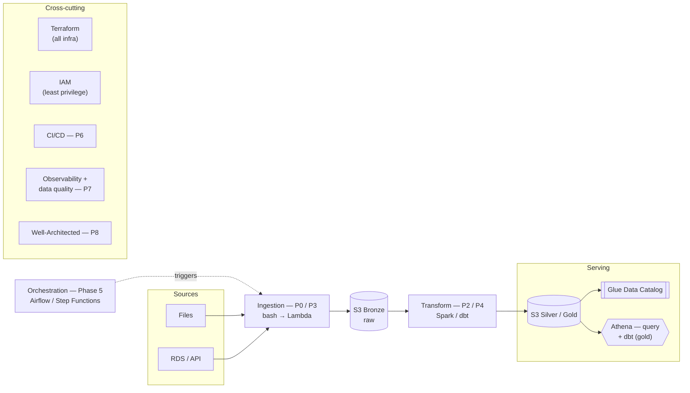

# cerberus-platform

A portfolio project that builds a working AWS lakehouse end to end — ingestion,
medallion storage, transformation, a queryable serving layer, orchestration,
observability, and IaC — demonstrating Data Platform, Platform, and Cloud
Engineering competence in one repository.

## Status

🔨 Phase 0 (manual foundation) — in progress.

See [docs/plan.md](docs/plan.md) for the full phased roadmap (Phases 0–8).

## Architecture



This is the target end-state, not current state (see [Status](#status)
above). For current-state notes and the governing constraints behind this
diagram, see [docs/architecture.md](docs/architecture.md).

## Repository layout

```
.
├── docs/                 # plan, architecture notes, ADRs
├── terraform/
│   ├── bootstrap/        # one-time state backend (S3 + DynamoDB lock)
│   ├── modules/          # reusable modules (storage, IAM, ...)
│   └── envs/dev/         # dev environment root module
├── ingestion/scripts/    # ingestion scripts (bash, later Lambda)
├── transform/dbt/        # dbt project: bronze → silver → gold
└── data/samples/         # small sample datasets for local testing
```

## Getting started

This project is being built incrementally; see [docs/plan.md](docs/plan.md)
for what's done and what's next. Common tasks are wired up in the
[Makefile](Makefile).

## Documentation

- [docs/plan.md](docs/plan.md) — the build plan and phased roadmap
- [docs/architecture.md](docs/architecture.md) — architecture overview
- [docs/adr/](docs/adr/) — architecture decision records

## License

[MIT](LICENSE)
