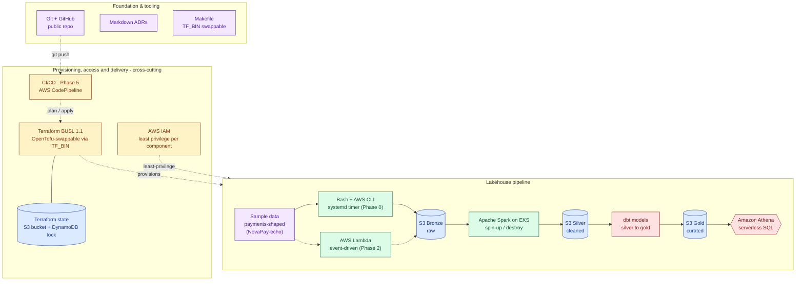

# cerberus-platform

[](https://github.com/ChiragVenkateshaiah/cerberus-platform/actions/workflows/terraform-plan.yml)
[](https://github.com/ChiragVenkateshaiah/cerberus-platform/actions/workflows/terraform-apply.yml)
[](https://github.com/ChiragVenkateshaiah/cerberus-platform/actions/workflows/code-ci.yml)
[](https://github.com/ChiragVenkateshaiah/cerberus-platform/actions/workflows/dbt-docs.yml)

A portfolio project that builds a working AWS lakehouse end to end — ingestion,
medallion storage, transformation, a queryable serving layer, orchestration,
observability, and IaC — demonstrating Data Platform, Platform, and Cloud
Engineering competence in one repository.

## Status

✅ Phase 0 (foundation, built by hand) — complete.
✅ Phase 1 (MVP: end-to-end lakehouse) — complete. A reviewer can run a
real Athena query against gold and get a result; `terraform apply` and
`terraform destroy` were verified live against the whole stack.
✅ Phase 2 (event-driven ingestion) — complete. Ingestion runs on a Lambda
(driven by the Phase 4 state machine) instead of the retired Phase 0
systemd timer, verified firing unattended. Its schedule is gated behind a
`pipeline_active` switch (ADR 0011, amended) — enabled only during a
compute exercise, since the full pipeline needs the spin-up/destroy EKS
layer to complete.
✅ Phase 3 (scalable compute) — complete. ADR 0007 (VPC network design for
Spark-on-EKS) is accepted; the full stack (VPC, EKS, Spark Operator, Spark
job) was applied live, a real Spark job ran on EKS and wrote verified
output to silver, and the stack was destroyed cleanly.
✅ Phase 4 (orchestration) — complete. ADR 0009 chose AWS Step Functions
over Airflow; a state machine (Lambda → Spark-on-EKS/dbt via ECS Fargate →
Athena) orchestrates the full ingest → transform → serve flow, tuned for
retries and execution visibility, retargeted from EventBridge Scheduler,
and verified with a real live execution end to end.
✅ Phase 5 (CI/CD) — complete. ADR 0011 chose GitHub Actions + OIDC
federation over AWS CodePipeline and split `envs/dev` into `dev-standing`
(CI-managed, no idle cost) and `dev-compute` (human-run only);
`terraform plan` runs on every PR and `terraform apply` runs unattended on
merge to `main`, both verified live against real AWS, including closing 9
real IAM permission gaps discovered across three live-apply attempts. A
`code-ci.yml` workflow lints Python (ruff) and validates the dbt project
(`dbt parse` + sqlfluff) on every PR; ADR 0012 closes the phase's
Well-Architected pass (milestone 5, `phase-5-cicd-complete`).
✅ Phase 6 (observability & data quality) — complete. A
`terraform/modules/observability` module adds a CloudWatch dashboard
(`cerberus-platform-pipeline`) over the pipeline's Step Functions / Lambda
/ Athena metrics plus an hourly "freshness probe" Lambda publishing
`Cerberus/Pipeline` custom metrics for data/run staleness (6.1); seven
CloudWatch alarms — two unconditional, five gated on `pipeline_active` —
notify a dedicated `cerberus-pipeline-alerts` SNS topic (6.2); the dbt
project gained schema/data-quality tests and the orchestrated step runs
`dbt build`, so bad data fails the run loudly instead of landing silently
(6.3). Data lineage (6.4) is a curated
[docs/lineage.md](docs/lineage.md) plus two generated companions on
[GitHub Pages](https://chiragvenkateshaiah.github.io/cerberus-platform/) —
dbt's model DAG and a runtime graph rendered from OpenLineage events a
serverless collector captures from the Spark and dbt steps (ADR 0013),
verified live on EKS. [docs/slo.md](docs/slo.md) defines six SLOs against
those metrics (6.5). ADR 0014 closes the phase's Well-Architected pass
(milestone 6, `phase-6-observability-and-data-quality-complete`) — the
first pass since milestone 1 to move risk buckets: 25→23 HIGH, as
`workload-observability`, `monitor-aws-resources`, and Performance's
`process-culture` each improved.
✅ Phase 7 (end-to-end platform validation) — complete. 7.1 scaled the
ingestion Lambda's synthetic payments workload 10x (`TRANSACTION_COUNT`
200 → 2000); 7.2 exercised the full orchestrated pipeline live in a
`dev-compute` window — 3 manually-started state-machine executions all
succeeded end to end (ingestion → Spark-on-EKS transform → dbt build →
Athena serving query), verified at every layer including OpenLineage
capture, with `dev-compute` torn down and `pipeline_active` returned to
`false` afterward. 7.3 replaced `cerberus-admin`'s `AdministratorAccess`
with six least-privilege policies built from its real CloudTrail history
([iam/cerberus-admin/](iam/cerberus-admin/)). 7.4 ran the full 57-question
Well-Architected review (ADR 0015, milestone 7).
7.5's [cost and security summary](docs/cost-security-summary.md) found the
whole build cost $5.74 gross, all of it covered by credits, and narrowed
the lineage collector to unauthenticated-only-during-exercises. Phase 7
was then extended with Prometheus metrics for the EKS/Spark layer: 7.6's
ADR 0016 chose an in-cluster agent writing to Amazon Managed Service for
Prometheus, viewed through self-hosted Grafana. 7.7 verified it live in a
`dev-compute` exercise on 2026-10-06: remote-write to AMP with no failed
samples, the Spark driver, executor and operator series on the
[Grafana dashboard](observability/grafana/dashboards/spark-on-eks.json),
and a peak of 4,349 active series against ADR 0016's ~10k estimate.
7.8 recorded one orchestrated run end to end (about 6 minutes, from the
Step Functions graph through S3, Athena, CloudWatch and Grafana to the
lineage graph). That exercise also found and fixed a 7.3 permission gap,
two data-quality issues and two CI gaps.

🔨 Phase 8 (scale validation) — in progress. It takes the pipeline from about
40k to 100M events in 10x steps, on Apache Iceberg with incremental
processing ([ADR 0017](docs/adr/0017-iceberg-incremental-processing.md),
accepted), and measures run time and cost per million events at each step.

See [docs/plan.md](docs/plan.md) for the full phased roadmap (Phases 0–8)
and [Phases.md](Phases.md) for subtask-level progress.

The platform models **synthetic payments data** from Phase 1 onward.

## Architecture


```mermaid
flowchart TB
    subgraph FOUND["Foundation & tooling"]
        direction LR
        GIT["Git + GitHub<br/>public repo"]
        ADR["Markdown ADRs"]
        MK["Makefile<br/>TF_BIN swappable"]
    end

    subgraph PIPE["Lakehouse pipeline"]
        direction LR
        SAMPLE["Sample data<br/>payments-shaped<br/>(NovaPay-echo)"]
        ING1["Bash + AWS CLI<br/>systemd timer (Phase 0)"]
        ING2["AWS Lambda<br/>event-driven (Phase 2)"]
        BRZ[("S3 Bronze<br/>raw")]
        SPARK["Apache Spark on EKS<br/>spin-up / destroy"]
        SLV[("S3 Silver<br/>cleaned")]
        DBT["dbt models<br/>silver to gold"]
        GLD[("S3 Gold<br/>curated")]
        ATH{{"Amazon Athena<br/>serverless SQL"}}

        SAMPLE --> ING1 --> BRZ
        SAMPLE -.-> ING2 -.-> BRZ
        BRZ --> SPARK --> SLV --> DBT --> GLD --> ATH
    end

    subgraph GOV["Provisioning, access and delivery - cross-cutting"]
        direction LR
        TF["Terraform BUSL 1.1<br/>OpenTofu-swappable via TF_BIN"]
        TFSTATE[("Terraform state<br/>S3 bucket + DynamoDB lock")]
        IAM["AWS IAM<br/>least privilege per component"]
        CICD["CI/CD - Phase 5<br/>AWS CodePipeline"]
        TF --- TFSTATE
        CICD -. plan / apply .-> TF
    end

    GIT -. git push .-> CICD
    TF -. provisions .-> PIPE
    IAM -. least-privilege .-> PIPE

    classDef storage fill:#dbeafe,stroke:#1e3a8a,color:#1e3a8a
    classDef compute fill:#dcfce7,stroke:#14532d,color:#14532d
    classDef provisioning fill:#fef3c7,stroke:#78350f,color:#78350f
    classDef tooling fill:#f3e8ff,stroke:#4c1d95,color:#4c1d95
    classDef query fill:#fee2e2,stroke:#7f1d1d,color:#7f1d1d

    class BRZ,SLV,GLD,TFSTATE storage
    class SPARK,ING1,ING2 compute
    class TF,IAM,CICD provisioning
    class GIT,ADR,MK tooling
    class DBT,ATH query
    class SAMPLE tooling
```

This is the target end-state, not current state (see [Status](#status)
above). For current-state notes, the full stack table, and the governing
constraints behind this diagram, see
[docs/architecture.md](docs/architecture.md).

## Repository layout

```
.
├── .claude/commands/     # /start-day, /end-day, /write-article,
│                         #   /note-maker, /git-cleaner session commands
├── .github/workflows/    # terraform plan on PR, apply on merge (5.1/5.2,
│                         #   against envs/dev-standing only), plus
│                         #   code-ci.yml (5.3): Python lint (ruff) + dbt
│                         #   validate (dbt parse + sqlfluff); dbt-docs.yml
│                         #   (6.4a/6.4d): builds the dbt DAG + the runtime
│                         #   lineage graph, deploys both to GitHub Pages on
│                         #   merge or manual dispatch
├── docs/                 # plan, architecture notes, ADRs, learning notes,
│                         #   lineage.md (6.4), slo.md (6.5),
│                         #   cost-security-summary.md (7.5),
│                         #   scale-metrics.md (8.3); docs/pages/ =
│                         #   the Pages landing page
├── articles/             # weekly engineering articles (see article.md)
├── terraform/
│   ├── bootstrap/        # state backend as code (S3 + DynamoDB lock)
│   ├── modules/          # reusable modules (S3 medallion, IAM, IAM spark,
│   │                     #   Glue catalog, Athena, Lambda ingestion, VPC,
│   │                     #   VPC NAT, EKS, Spark Operator, Spark job
│   │                     #   service account, orchestration runner
│   │                     #   (ECR/Fargate), Step Functions, observability
│   │                     #   (dashboard, freshness probe, alarms/SNS),
│   │                     #   lineage (OpenLineage collector), GitHub OIDC,
│   │                     #   prometheus_workspace (AMP, 7.7),
│   │                     #   eks_observability (Prometheus agent + Grafana
│   │                     #   on EKS, 7.7))
│   ├── envs/dev-standing/  # CI-managed root (5.1): S3/IAM/Glue/Athena/
│   │                     #   Lambda/orchestration/observability/GitHub OIDC/
│   │                     #   AMP workspace -- no idle cost, planned on every
│   │                     #   PR, applied on merge
│   └── envs/dev-compute/  # human-run root, spin-up/destroy per exercise:
│                         #   VPC NAT/EIP, EKS, Spark, Prometheus agent +
│                         #   Grafana -- never touched by CI (ADR 0011)
├── ingestion/scripts/    # ingestion scripts: synthetic payments generator
│                         #   + shared payments_lib.py core (Python, Phase
│                         #   1); ingest_weather.sh (Phase 0, unscheduled —
│                         #   retired as the active feed); run_payments_
│                         #   scheduled.sh (Phase 0's systemd wrapper,
│                         #   unscheduled — retired 2.5, Lambda is now the
│                         #   only active ingestion path)
├── ingestion/lambda/     # event-driven ingestion Lambda handler, wraps
│                         #   payments_lib.py (Phase 2)
├── transform/scripts/    # bronze → silver → gold transform (Python,
│                         #   Phase 1): silver = flattened event history,
│                         #   gold = current-state (still denormalized)
├── transform/dbt/        # dbt project: gold fact/dimension models (1.9)
│                         #   + schema/data-quality tests (6.3)
├── transform/spark/      # PySpark bronze -> silver job (3.5), run on the
│                         #   EKS cluster via the Spark Operator (3.4);
│                         #   spark-application.yaml + submit_job.sh (not
│                         #   Terraform-managed -- see its own header);
│                         #   bulk payments generator for the Phase 8
│                         #   scale ladder (8.3, ADR 0018): generate_bulk.sh
├── orchestration/        # state_machine.asl.json.tftpl -- the orchestration
│                         #   state machine's ASL definition (4.2/4.3),
│                         #   templated by terraform/modules/step_functions;
│                         #   exercise.sh -- `make exercise`, the one-command
│                         #   apply -> run -> collect -> destroy (8.3)
├── orchestration/runner/ # container image the state machine's ECS Fargate
│                         #   transform/dbt steps run: Dockerfile,
│                         #   entrypoint scripts, shared lib.sh (4.2)
├── observability/        # freshness_probe/handler.py -- hourly Lambda
│                         #   publishing pipeline/data freshness as
│                         #   CloudWatch custom metrics (6.1);
│                         #   grafana/dashboards/ -- Grafana dashboard JSON
│                         #   provisioned into the EKS Grafana (7.7);
│                         #   scale/ -- the Phase 8 metric collector and
│                         #   its per-run records (8.3)
├── lineage/              # collector/handler.py -- the OpenLineage event
│                         #   collector Lambda behind an API Gateway HTTP
│                         #   API, writing events to S3 (6.4b, ADR 0013);
│                         #   render/render_graph.py -- renders the captured
│                         #   events into the Pages site (6.4d)
├── iam/cerberus-admin/   # cerberus-admin's 6 least-privilege policies (7.3)
│                         #   as JSON -- the audit trail for policies
│                         #   applied via CLI/root console, deliberately
│                         #   not Terraform-managed (see its README)
├── serving/queries/      # demo Athena SQL against gold (1.10)
├── serving/scripts/      # runs the demo query as cerberus-serving
└── data/samples/         # small sample datasets for local testing
```

## Getting started

This project is being built incrementally; see [docs/plan.md](docs/plan.md)
for what's done and what's next. Common tasks are wired up in the
[Makefile](Makefile).

### Working across machines

This project runs on two machines (workstation + WSL2 laptop) synced through
GitHub. Both are configured with `pull.rebase = true` so `git pull` rebases
cleanly instead of creating a merge commit.

**First ritual on any machine — run `/git-cleaner` in Claude Code.** It checks
both repos (`cerberus-platform` and `tessera`) for uncommitted changes, fetches
and rebases from origin, prunes stale remote-tracking branches, and warns if
`terraform init` needs re-running (providers are gitignored and don't travel
between machines).

**Golden rule:** push before switching machines. A clean push means the other
machine can always fast-forward without conflicts.

On a fresh clone, set the rebase pull strategy once per repo:

```bash
git config pull.rebase true
```

## Documentation

- [docs/plan.md](docs/plan.md) — the build plan and phased roadmap
- [docs/architecture.md](docs/architecture.md) — architecture overview
- [docs/lineage.md](docs/lineage.md) — data lineage (6.4): the curated
  whole-pipeline view at table and column granularity. Two generated
  companions on [GitHub Pages](https://chiragvenkateshaiah.github.io/cerberus-platform/):
  the [dbt model DAG](https://chiragvenkateshaiah.github.io/cerberus-platform/dbt/)
  (offline from `manifest.json`) and the
  [runtime lineage graph](https://chiragvenkateshaiah.github.io/cerberus-platform/lineage/)
  (from the Spark/dbt steps' own OpenLineage events — 6.4b collector, 6.4c
  producers, 6.4d render)
- [docs/slo.md](docs/slo.md) — service level objectives (6.5): the platform's
  reliability targets, the CloudWatch SLIs behind them, and the
  error-budget policy — all backed by the 6.1/6.2 metrics and alarms
- [docs/cost-security-summary.md](docs/cost-security-summary.md) — cost and
  security summary (7.5): what the build actually cost and where it went,
  how every caller authenticates, and the residual risks accepted on purpose
- [docs/scale-metrics.md](docs/scale-metrics.md) — the Phase 8 metric set
  (8.3): what each scale step measures, where every number comes from, the
  cost method, and the baseline at today's volume
- [docs/adr/](docs/adr/) — architecture decision records
- [docs/courses-map-to-phases.md](docs/courses-map-to-phases.md) — which
  courses (if any) map to each phase, and where no course exists
- [docs/notes/](docs/notes/) — day-by-day learning notes: theory explained
  alongside the actual code written that session, for reference/study
  rather than status tracking (see [checkpoint.md](checkpoint.md) for that);
  generated via `/note-maker`
- [article.md](article.md) — rules for the weekly engineering write-up,
  generated via `/write-article`; published articles live in
  [articles/](articles/), indexed in `articles/README.md`
- `/start-day` / `/end-day` (`.claude/commands/`) — session commands that
  read and update [checkpoint.md](checkpoint.md) and [Phases.md](Phases.md)
  at the start and close of each work session
- `/note-maker` (`.claude/commands/note-maker.md`) — generates the
  `docs/notes/day-NN.md` learning notes above
- `/git-cleaner` (`.claude/commands/git-cleaner.md`) — the two-machine
  sync ritual run at the start of any session; see "Working across
  machines" above

## License

[MIT](LICENSE)
