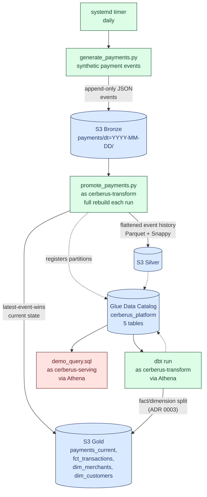
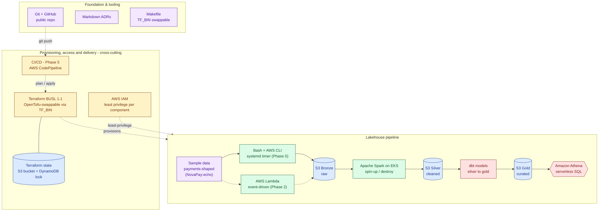

# Architecture

_Status: Phase 0 complete, Phase 1 MVP built and verified (1.1–1.11 done;
1.12–1.13 close out the phase) — this document tracks the architecture as it
actually exists today. For the target end-state and phased plan, see
[plan.md](plan.md)._

## Governing constraints

These shape every architectural decision in this repo (see
[plan.md's guiding principles](plan.md#guiding-principles)):

- **Everything as code after Phase 0.** Phase 0 is the one hand-built
  exception, kept deliberately small. From Phase 1 onward, if it isn't in
  Terraform, it doesn't exist — and Terraform is cross-cutting, written by
  each phase for its own resources rather than in one conversion phase.
- **Cost discipline.** Free tier wherever possible. The one non-free
  component (EKS, Phase 3) is treated as spin-up/run-job/tear-down, not a
  standing resource — `terraform destroy` is part of the normal workflow.
- **MVP boundary.** The lakehouse is queryable end to end at the close of
  Phase 1 (raw → bronze → silver → gold → Athena, all built by
  `terraform apply`). Everything after Phase 1 deepens an already-working
  platform rather than building toward a first working state.
- **Synthetic payments as the data domain.** From Phase 1 the pipeline models
  generated payments data. Phase 0's weather ingestion was a placeholder to
  prove the mechanism and remains only as that phase's artifact.

## Current state — Phase 1 MVP (built and verified)

Phase 0's hand-built resources (the bronze bucket, the Terraform state
backend) are no longer a separate, uncodified layer — they were adopted into
Terraform in 1.4/1.5 and are now part of the same `terraform apply` as
everything else below. The one Phase 0 piece that's still running as
originally built is the systemd timer; everything it feeds into is new.



**Ingestion (1.3, Phase 0's mechanism).** A systemd `--user` timer runs
`generate_payments.py` daily, producing a deterministic 15-merchant/
75-customer roster and append-only lifecycle events
(`created` → `authorized` → `settled`/`failed`, plus refunds) per ADR 0003.
Events land as raw JSON, grouped by the UTC day they occurred, under
`payments/dt=YYYY-MM-DD/` in bronze — a single run can span several day
partitions, since a `settled` event can land days after its `created` event.

**Storage (1.4/1.5).** Three S3 buckets — bronze, silver, gold — provisioned
by the `s3_medallion` Terraform module (bronze adopted via `terraform import`
of its 5 hand-created resources, silver/gold created new), each versioned,
SSE-S3 encrypted, public access blocked. Bronze alone carries a 30-day
Standard-IA lifecycle transition. The Terraform state backend itself
(1.5) was adopted the same way, with **zero resources created** — the
`terraform plan` came back "No changes" immediately after import.

**Transform (1.7).** `promote_payments.py` (Python, boto3 + pandas +
pyarrow) does a full rebuild of every bronze object on each run — the
simplest correct option at this data volume, and trivially idempotent. It
writes silver as the complete flattened event history (Parquet+Snappy, one
file per day partition) and gold as a denormalized current-state table
(`payments_current`, latest-event-wins per `transaction_id`). It runs as the
`cerberus-transform` IAM role, assumed via STS, not as the admin identity.

**Catalog (1.8).** A Glue Data Catalog database (`cerberus_platform`) with
hand-declared schemas — chosen over a Glue Crawler because the schema is
already fully known and owned end-to-end. Table partitions are registered
directly by `promote_payments.py` via the Glue API (data, not
infrastructure, so Terraform doesn't manage them), idempotently.

**dbt (1.9).** The fact/dimension split ADR 0003 deferred out of 1.7 —
`dim_merchants`, `dim_customers` (deduplicated off the fixed roster, no
latest-wins needed since roster values never change) and `fct_transactions`
(latest-event-wins in SQL, referencing merchant/customer IDs as foreign
keys instead of embedding their details). Runs as `cerberus-transform`
against Athena, materializing each mart into its own prefix in gold
alongside `payments_current`.

**Serving (1.10).** A minimal Athena workgroup and query-results bucket
(pulled forward from 1.10 into 1.9, since dbt can't run without them,
`enforce_workgroup_configuration` deliberately off — see the athena module's
comments for why), plus `serving/queries/demo_query.sql` — a join across
`fct_transactions` and `dim_merchants` for settled revenue by merchant,
runnable end to end via `serving/scripts/run_demo_query.sh` as the
`cerberus-serving` role. Last verified run:

```
merchant_name        merchant_category  settled_transactions  total_settled_amount
Blair PLC             retail             78                    42384.78
Dudley Group           grocery            74                    41448.90
Mcclure, Ward and Lee  electronics        66                    38662.96
...                    ...                ...                   ...
```

— across all 15 merchants. This is the MVP definition-of-done from plan.md,
literally: "a reviewer runs a single Athena query against the gold table and
gets a result."

**IAM (1.6/1.8/1.9/1.10).** Three roles, each scoped to exactly what it
touches: `cerberus-ingestion` (write-only, `bronze/payments/*`),
`cerberus-transform` (read bronze, read/write silver+gold, Glue DDL scoped
to the tables it owns, Athena query execution for dbt), `cerberus-serving`
(read-only gold + catalog, read-only Athena query execution). Each is
assumable via a named AWS CLI profile (`role_arn` + `source_profile`
chaining) rather than long-lived credentials.

**Verified end-to-end (1.11).** `terraform destroy` and `terraform apply`
were run for real against this stack, not just planned — bronze's raw data
was backed up first, all four buckets emptied, then the full 31-resource
stack destroyed and rebuilt from nothing (0 errors after fixing one gap: the
Athena workgroup needs `force_destroy` to clear its query-execution history).
Deleting the Glue database cascade-deleted the dbt-created tables along with
it, confirming the whole catalog tears down cleanly even though dbt's tables
aren't Terraform state. Bronze's data was restored and the transform + dbt
re-run to reconstruct silver/gold/marts, proving plan.md's MVP claim
("`terraform apply` builds the whole thing from nothing; `terraform destroy`
removes it cleanly") against live infrastructure rather than in principle.

## Target architecture (north star, post-MVP)

Phases 2–7 layer onto the now-working MVP above — event-driven ingestion,
Spark on EKS, orchestration, CI/CD, observability, and a final validation
pass. Semantically mirrors the north-star diagram in
[plan.md](plan.md#north-star-architecture) — plan.md is the source of truth,
update there first if this drifts:



Dashed edges are either a later-phase path not built yet (Lambda ingestion,
the git-push → CI/CD → Terraform trigger) or a cross-cutting relationship
(Terraform provisioning the pipeline, IAM constraining it) rather than a
data-flow step. Solid edges are the core bronze → silver → gold data flow.

Terraform state backend (S3 + DynamoDB lock, Phase 0.5 → adopted as code in
Phase 1) underpins all of the above — it's what makes `terraform apply` /
`terraform destroy` safe to run repeatedly across every later phase.

**Orchestration is AWS Step Functions** (Phase 4) — serverless and
pay-per-transition, with no standing scheduler to host. The trade-off against
Airflow is still worth recording as an ADR when Phase 4 starts (see
[plan.md, Phase 4](plan.md#phase-4--orchestration)).

### Full stack

| Layer | Component | Notes |
|-------|-----------|-------|
| Provisioning / IaC | Terraform (BUSL 1.1) | **Built.** `TF_BIN` in the [Makefile](../Makefile) makes OpenTofu a drop-in swap |
| Storage | Amazon S3 | **Built.** Medallion layout: bronze (raw) → silver (event history) → gold (curated, denormalized + dbt marts) |
| Storage | Amazon DynamoDB | **Built.** Terraform state lock table, paired with an S3 state bucket for the backend |
| Ingestion | Bash + AWS CLI | **Built** (Phase 0, still active). Scheduled with a systemd timer |
| Ingestion | AWS Lambda | Event-driven ingestion, replaces the bash script (Phase 2) |
| Orchestration | AWS Step Functions | Ingest → transform → serve as one state machine (Phase 4) |
| Transform / compute | Python (boto3 + pandas + pyarrow) | **Built** (1.7). Full rebuild each run; Spark below is the Phase 3 upgrade path |
| Transform / compute | Apache Spark on Amazon EKS | Heavy transform layer; spin-up-and-destroy since EKS isn't free-tier (Phase 3) |
| Serving / query | Amazon Athena | **Built** (1.9/1.10). Serverless SQL over S3 |
| Serving / query | dbt | **Built** (1.9). Fact/dimension models for the silver → gold serving layer |
| Access control | AWS IAM | **Built** (1.6/1.8/1.9/1.10). Least-privilege roles/policies per component |
| CI/CD | AWS CodePipeline | `git push` → plan/apply + deploy (Phase 5) |
| Observability | Amazon CloudWatch | Dashboards, alarms, log insights (Phase 6) |
| Foundation / tooling | Git + GitHub | Public repo |
| Foundation / tooling | Markdown ADRs | Decision log in [docs/adr/](adr/) |
| Foundation / tooling | Makefile | Common Terraform/OpenTofu tasks |
| Foundation / tooling | Sample data | Payments-shaped dataset (NovaPay-echo) |

## Data layout (medallion)

| Layer  | Purpose                                              | Format                        |
|--------|-------------------------------------------------------|--------------------------------|
| Bronze | Raw, as-ingested payment events, append-only           | JSON, `payments/dt=YYYY-MM-DD/` |
| Silver | Complete flattened event history                       | Parquet + Snappy, `dt=` partitioned |
| Gold   | Current-state + fact/dimension marts, query-ready       | Parquet + Snappy, unpartitioned |

Resolved by ADR 0002 (bucket topology, partitioning, formats) and ADR 0003
(the payment-event entity shape, append-only semantics, PII handling).

## Decisions

Non-obvious architectural choices are recorded as ADRs in
[docs/adr/](adr/):

- [0001-record-architecture-decisions.md](adr/0001-record-architecture-decisions.md) — why ADRs at all
- [0002-medallion-layout.md](adr/0002-medallion-layout.md) — bucket topology, partitioning, file formats, immutability, lifecycle
- [0003-synthetic-payments-data-model.md](adr/0003-synthetic-payments-data-model.md) — the payment-event entity, append-only semantics, PII handling

This document is updated as phases land; the ADR log is the source of truth
for *why*.
