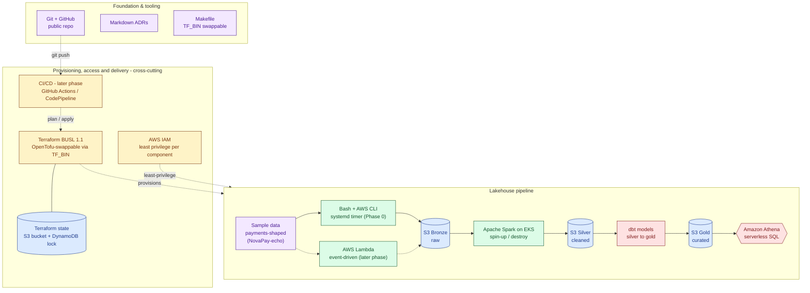

# Architecture

_Status: Phase 0 — this document tracks the architecture as it actually
exists today. For the target end-state and phased plan, see
[plan.md](plan.md)._

## Governing constraints

These shape every architectural decision in this repo (see
[plan.md's guiding principles](plan.md#guiding-principles)):

- **Everything as code after Phase 0.** Phase 0 is the one hand-built
  exception, kept deliberately small so it can be re-created in Terraform
  in Phase 1. From Phase 1 onward, if it isn't in Terraform, it doesn't exist.
- **Cost discipline.** Free tier wherever possible. The one non-free
  component (EKS, Phase 4) is treated as spin-up/run-job/tear-down, not a
  standing resource — `terraform destroy` is part of the normal workflow.
- **MVP boundary.** The lakehouse is queryable end to end at the close of
  Phase 2 (raw → bronze → silver → gold → Athena, all built by
  `terraform apply`). Everything after Phase 2 deepens an already-working
  platform rather than building toward a first working state.

## Current state (Phase 0)

Provisioned manually, not yet code-defined. Phase 0 stands up the project
skeleton and lands raw data in a hand-created S3 bronze bucket via a bash
script on a systemd timer, with a hand-created S3 + DynamoDB Terraform
state backend prepared for Phase 1 to build on. None of this is
Terraform-managed yet — re-creating it as code is exactly what Phase 1 does.

## Target architecture (north star)

Semantically mirrors the north-star diagram in
[plan.md](plan.md#north-star-architecture) — plan.md is the source of truth,
update there first if this drifts:

Dashed edges are either a later-phase path not built yet (Lambda ingestion,
the git-push → CI/CD → Terraform trigger) or a cross-cutting relationship
(Terraform provisioning the pipeline, IAM constraining it) rather than a
data-flow step. Solid edges are the core bronze → silver → gold data flow.

Terraform state backend (S3 + DynamoDB lock, Phase 0.5 → re-created as code
in Phase 1) underpins all of the above — it's what makes `terraform apply` /
`terraform destroy` safe to run repeatedly across every later phase.

**Orchestration engine is not yet decided.** Airflow (on EKS) vs. AWS Step
Functions is an open trade-off to be settled by ADR when Phase 5 starts (see
[plan.md, Phase 5](plan.md#phase-5--orchestration)).

### Full stack

| Layer | Component | Notes |
|-------|-----------|-------|
| Provisioning / IaC | Terraform (BUSL 1.1) | `TF_BIN` in the [Makefile](../Makefile) makes OpenTofu a drop-in swap |
| Storage | Amazon S3 | Medallion layout: bronze (raw) → silver (cleaned) → gold (curated) |
| Storage | Amazon DynamoDB | Terraform state lock table, paired with an S3 state bucket for the backend |
| Ingestion | Bash + AWS CLI | Scheduled with a systemd timer (Phase 0, by hand) |
| Ingestion | AWS Lambda | Event-driven ingestion, replaces the bash script (later phase) |
| Transform / compute | Apache Spark on Amazon EKS | Heavy transform layer; spin-up-and-destroy since EKS isn't free-tier |
| Serving / query | Amazon Athena | Serverless SQL over S3 |
| Serving / query | dbt | Models for the silver → gold serving layer |
| Access control | AWS IAM | Least-privilege roles/policies per component |
| CI/CD | GitHub Actions or AWS CodePipeline | `git push` → plan/apply + deploy (later phase) |
| Foundation / tooling | Git + GitHub | Public repo |
| Foundation / tooling | Markdown ADRs | Decision log in [docs/adr/](adr/) |
| Foundation / tooling | Makefile | Common Terraform/OpenTofu tasks |
| Foundation / tooling | Sample data | Payments-shaped dataset (NovaPay-echo) |

## Data layout (medallion)

| Layer  | Purpose                                   | Format            |
|--------|--------------------------------------------|-------------------|
| Bronze | Raw, as-ingested data                       | source-native     |
| Silver | Cleaned, validated, conformed               | TBD — see ADR     |
| Gold   | Business-level, query-ready aggregates      | TBD — see ADR     |

Silver/gold storage format is a deliberately open decision, reserved for the
medallion-layout ADR referenced in [plan.md](plan.md#phase-1--iac-foundation)
(Phase 1 artifact), not decided ahead of that ADR.

## Decisions

Non-obvious architectural choices are recorded as ADRs in
[docs/adr/](adr/), starting with
[0001-record-architecture-decisions.md](adr/0001-record-architecture-decisions.md).
This document will be updated as phases land; the ADR log is the source of
truth for *why*.
