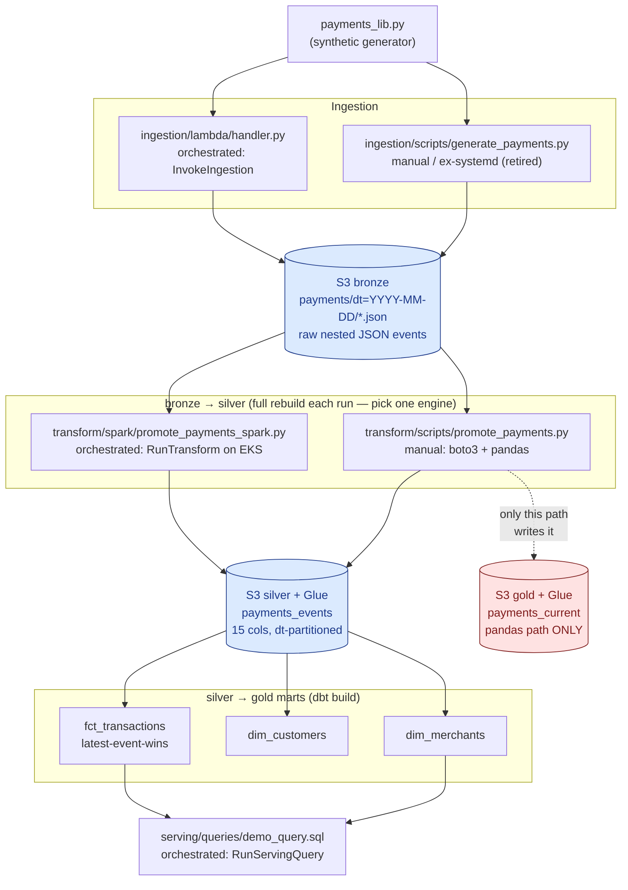

# Data lineage

_Phase 6.4. Where the synthetic payments data originates, every transform it
passes through, and every dataset it lands in — at table and column
granularity, across both transform engines._

This document is the **curated, whole-pipeline** view. It is maintained by
hand, the same way the diagrams in [architecture.md](architecture.md) are.
Two other artifacts complement it:

| Artifact | Scope | Generation |
|---|---|---|
| **This file** | The entire pipeline: generator → bronze → silver → gold marts + `payments_current` → serving | Hand-maintained |
| **[dbt docs site](https://chiragvenkateshaiah.github.io/cerberus-platform/dbt/)** | Only the dbt-managed slice (`payments_events` → `fct_transactions` / `dim_*`) | Auto-generated offline from `manifest.json` on every merge to `main` ([`.github/workflows/dbt-docs.yml`](../.github/workflows/dbt-docs.yml)) |
| **OpenLineage capture** (6.4c, [ADR 0013](adr/0013-lineage-openlineage-serverless-collector.md)) | Runtime events from **both** the Spark and dbt steps | Emitted per run to a serverless collector; rendered by 6.4d |

Why three and not one: see [_Why not a lineage platform_](#why-not-a-lineage-platform)
below.

---

## Three kinds of lineage

- **Dataset-level** — which dataset is derived from which. The shape of the
  DAG.
- **Column-level** — which output column is computed from which input
  column(s). This is where the fact/dimension split (ADR 0003) and the
  latest-event-wins resolution actually show up.
- **Run-level (operational)** — which pipeline execution produced which
  physical files, and when. This is what [6.1's freshness probe](../observability/freshness_probe/handler.py)
  approximates today (age of the newest object per layer) and what 6.4c's
  OpenLineage events will make exact.

---

## Dataset-level lineage

**The orchestrated pipeline** ([Step Functions](../orchestration/state_machine.asl.json.tftpl))
runs: `InvokeIngestion` (Lambda) → `RunTransform` (Spark on EKS, silver only)
→ `RunDbt` (`dbt build`, the marts) → `RunServingQuery` (Athena). It never
writes `payments_current` — see [finding 2](#findings).

**The manual path** (`promote_payments.py` + local `dbt build` +
`run_demo_query.sh`) is what predates orchestration and is still used for
local iteration. It *does* write `payments_current`.

---

## Column-level lineage

### bronze JSON → silver `payments_events`

Both `promote_payments.py` (`flatten()`) and `promote_payments_spark.py`
(`flatten()`) produce the identical 15-column schema. `event_timestamp` is
parsed from string to `timestamp`; `dt` is derived, not carried.

| `payments_events` column | bronze source path | transform |
|---|---|---|
| `transaction_id` | `transaction_id` | copy |
| `event_type` | `event_type` | copy |
| `event_timestamp` | `event_timestamp` | parse ISO-8601 string → `timestamp` |
| `amount` | `amount` | copy |
| `currency` | `currency` | copy |
| `merchant_id` | `merchant.merchant_id` | unnest |
| `merchant_name` | `merchant.name` | unnest |
| `merchant_category` | `merchant.category` | unnest |
| `customer_id` | `customer.customer_id` | unnest |
| `customer_name` | `customer.name` | unnest |
| `customer_email` | `customer.email` | unnest |
| `payment_method_type` | `payment_method.type` | unnest |
| `payment_method_brand` | `payment_method.brand` | unnest (null for non-card) |
| `payment_method_last4` | `payment_method.last4` | unnest (null for non-card) |
| `payment_method_token` | `payment_method.token` | unnest |
| `dt` _(partition key)_ | `event_timestamp` | `date_format(…, 'yyyy-MM-dd')` |

### silver `payments_events` → gold `fct_transactions` (dbt)

One row per `transaction_id`, the row being the **latest lifecycle event**
resolved by `row_number() over (partition by transaction_id order by
event_timestamp desc, <fixed lifecycle rank> desc)` — see the model header
for why the tiebreak exists (the 2026-08-11 bug). Merchant/customer detail
is **dropped** here and moved to the dimensions; only the FKs survive.

| `fct_transactions` column | `payments_events` source | transform |
|---|---|---|
| `transaction_id` | `transaction_id` | window partition key |
| `status` | `event_type` | value from the winning event |
| `last_event_at` | `event_timestamp` | value from the winning event |
| `amount` | `amount` | value from the winning event |
| `currency` | `currency` | value from the winning event |
| `merchant_id` | `merchant_id` | FK → `dim_merchants` |
| `customer_id` | `customer_id` | FK → `dim_customers` |
| `payment_method_type` | `payment_method_type` | value from the winning event |
| `payment_method_brand` | `payment_method_brand` | value from the winning event |
| `payment_method_last4` | `payment_method_last4` | value from the winning event |
| `payment_method_token` | `payment_method_token` | value from the winning event |

### silver `payments_events` → gold `dim_merchants` / `dim_customers` (dbt)

`select distinct` off the fixed roster (ADR 0003 — roster values never
change, so no latest-wins needed).

| `dim_merchants` column | source | | `dim_customers` column | source |
|---|---|---|---|---|
| `merchant_id` | `payments_events.merchant_id` | | `customer_id` | `payments_events.customer_id` |
| `merchant_name` | `payments_events.merchant_name` | | `customer_name` | `payments_events.customer_name` |
| `merchant_category` | `payments_events.merchant_category` | | `customer_email` | `payments_events.customer_email` |

### silver `payments_events` → gold `payments_current` (pandas only)

Same latest-event-wins resolution as `fct_transactions`
(`promote_payments.py`'s `EVENT_TYPE_RANK` is the SQL tiebreak's twin), but
**denormalized** — it keeps all 15 columns inline, including
`merchant_name` / `customer_email` etc. that `fct_transactions` normalizes
away. One row per `transaction_id`. Written only by the manual pandas path.

### gold → serving `demo_query.sql`

| result column | source | transform |
|---|---|---|
| `merchant_name` | `dim_merchants.merchant_name` | group key |
| `merchant_category` | `dim_merchants.merchant_category` | group key |
| `settled_transactions` | `fct_transactions.transaction_id` | `count(*)` where `status = 'settled'` |
| `total_settled_amount` | `fct_transactions.amount` | `round(sum(…), 2)` where `status = 'settled'` |

Join: `fct_transactions.merchant_id = dim_merchants.merchant_id`.

---

## Run-level (operational) lineage

| Edge | Orchestrated producer | Manual producer | Glue partition registration |
|---|---|---|---|
| generator → bronze | `InvokeIngestion` → `ingestion/lambda/handler.py` | `generate_payments.py` (systemd, retired 2026-08-12) | n/a — bronze is not cataloged |
| bronze → silver | `RunTransform` → ECS Fargate → `entrypoint_transform.sh` → Spark on EKS (`promote_payments_spark.py`) | `promote_payments.py` | `MSCK REPAIR TABLE` (orchestrated) / direct `glue:BatchCreatePartition` (pandas) |
| silver → marts | `RunDbt` → ECS Fargate → `entrypoint_dbt.sh` → `dbt build` | local `dbt build` | dbt-athena manages the mart tables directly |
| silver → `payments_current` | _(none — not in the state machine)_ | `promote_payments.py` | Terraform-managed table, no partitions |
| gold → serving | `RunServingQuery` → Athena native integration | `serving/scripts/run_demo_query.sh` | n/a |

Physical file identity differs by engine: the pandas path writes one
`events.parquet` per `dt=` partition; Spark writes `part-*.snappy.parquet`.
Both are read through the same `payments_events` Glue table (directory-based,
not filename-based), so queries are identical — but a lineage tool keyed on
object identity would treat them as distinct sources.

---

## Findings

1. **dbt sees only its own slice.** `ref()` / `source()` gives dbt the
   `payments_events → fct_transactions / dim_*` edges for free (this is what
   the [dbt docs site](https://chiragvenkateshaiah.github.io/cerberus-platform/dbt/)
   renders, and what [6.3's tests](../transform/dbt/models/) traverse). dbt
   is structurally blind to everything upstream of `payments_events` — the
   generator, the bronze→silver flatten (whichever engine) — and to
   `payments_current`. Any whole-pipeline lineage has to come from
   elsewhere: this document, and 6.4c's OpenLineage capture.

2. **`payments_current` is orphaned in the orchestrated pipeline.** The
   Step Functions execution runs Spark (silver) then dbt (marts) then
   Athena — nothing in it writes `payments_current`. Only a manual
   `promote_payments.py` run does. `fct_transactions` is its functional
   successor: same latest-event-wins semantics, but normalized. The Glue
   table and its S3 data still exist and still answer queries; they just go
   stale between manual runs. Whether to formally retire `payments_current`
   is an open call, not made here.

3. **The silver schema has three hand-synced definitions** — `PARQUET_COLUMNS`
   in `promote_payments.py`, the `flatten()` select list in
   `promote_payments_spark.py`, and `payment_columns` in
   [`glue_catalog/main.tf`](../terraform/modules/glue_catalog/main.tf).
   There is no shared schema source. A column added or renamed in one place
   diverges silently until a query fails. The code comments already flag
   this; from a lineage standpoint it means the bronze→silver column map
   above is only as trustworthy as the last manual reconciliation.

4. **Ingestion is retirement-capped** (`RETIRE_ON_OR_AFTER=2026-08-17` in
   the Lambda's environment). Bronze does not grow on a schedule; fresh
   data needs a deliberate generator run. So bronze "freshness" is a
   manual-action signal, not a pipeline-health signal — the same framing
   [6.1's dashboard](../terraform/modules/observability/) and 6.2's alarms
   already use (no `BronzeData` freshness alarm).

---

## Why not a lineage platform

The obvious tools — **Marquez** (the OpenLineage reference server) and
**Amazon DataZone** — were both rejected for 6.4:

- **Marquez** is a standing Postgres database plus a web service. **DataZone**
  is a managed domain with its own project/environment structure. Either one
  is idle infrastructure with a monthly cost, which is exactly the shape
  ADR 0007 / ADR 0009 / ADR 0011 spent three phases keeping *out* of this
  platform (serverless, spin-up/destroy, no idle bill).
- The data volume — a few hundred synthetic transactions per run, a
  three-model dbt project — does not justify a lineage platform.

What 6.4 does instead ([ADR 0013](adr/0013-lineage-openlineage-serverless-collector.md)):
emit **OpenLineage** events from both the Spark job and `dbt build` to a
serverless collector (API Gateway + Lambda → S3, zero idle cost, same
pattern as the freshness probe), and render the accumulated events into the
[Pages site](https://chiragvenkateshaiah.github.io/cerberus-platform/)
alongside the dbt docs. Real automated capture across both engines, no
server to run.

---

## Maintenance

The Mermaid graphs and column tables here are hand-maintained — treat them
like the `architecture.md` diagrams. They should be re-checked whenever:

- a column is added to the silver schema (all three definitions — finding 3),
- a dbt model's `select` list changes,
- the state machine gains or drops a step, or
- `payments_current` is retired.

Once 6.4c lands, the OpenLineage events become the runtime cross-check: if
the captured graph and this document disagree, one of them is wrong.
